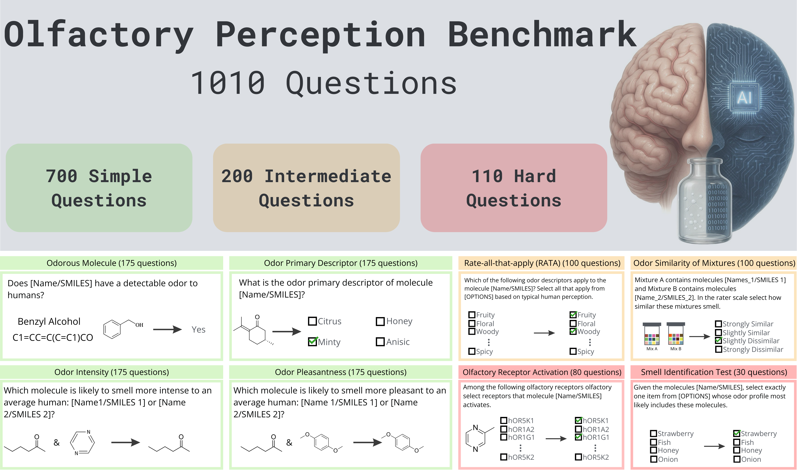

# Olfactory Perception (OP) Benchmark




A comprehensive benchmark for evaluating whether large language models can reason about smell. The benchmark contains 1,010 questions across eight task categories, each presented in two prompt formats (SMILES and compound names), enabling direct comparison of molecular representations.

**Paper:** *Benchmark for Assessing Olfactory Perception of Large Language Models*

---

## Benchmark Overview

| Category | Questions | Difficulty | Task Type |
|---|---|---|---|
| Odor Classification (OC) | 175 | Simple | Binary: Odorous / Odorless |
| Primary Odor Descriptor (POD) | 175 | Simple | 4-way multiple choice |
| Odor Intensity (OIn) | 175 | Simple | Pairwise comparison + rating |
| Odor Pleasantness (OPl) | 175 | Simple | Pairwise comparison + rating |
| Rate-All-That-Apply (RATA) | 100 | Intermediate | Multi-label from 138 descriptors |
| Odor Similarity of Mixtures (OS) | 100 | Intermediate | 4-point scale + distance |
| Olfactory Receptor Activation (ORA) | 80 | Hard | Multi-label receptor selection |
| Smell Identification Test (SIT) | 30 | Hard | 4-way identification from mixtures |

Each question is presented in two prompt formats:
- **Prompt 1:** Isomeric SMILES notation
- **Prompt 2:** Common compound names

Ground-truth answers are derived from established olfactory science datasets and resources.

## Repository Structure

```
.
├── Benchmark/
│   ├── OP_Benchmark.csv                  # Main benchmark (1,010 questions)
│   ├── 1-Simple_1/                       # Odor classification source data
│   ├── 2-Simple_2/                       # Primary odor descriptor source data
│   ├── 3-Simple_3_and_4/                 # Intensity and pleasantness source data
│   ├── 4-Intermediate_1/                 # RATA source data
│   │   └── Translations_GPT5.2/          # Multilingual RATA translations (20 languages)
│   ├── 5-Intermediate_2/                 # Mixture similarity source data
│   ├── 6-Hard_1/                         # Olfactory receptor activation source data
│   ├── 7-Hard_2/                         # Smell identification source data
│   └── Combining_all.ipynb               # Notebook for assembling the benchmark
├── Results/
│   ├── benchmark_results/                # Model results on main benchmark (21 CSVs)
│   └── translations_results_RATA/        # Model results on multilingual RATA (7 models)
├── Analysis/
│   ├── Analysis.ipynb                    # Evaluation and figure generation
│   └── Figure_*.pdf                      # Paper figures
└── Submissions/
    ├── claude.ipynb                       # Anthropic Claude
    ├── deepseek.ipynb                     # DeepSeek R1 
    ├── gemini.ipynb                       # Google Gemini 
    ├── openai.ipynb                       # OpenAI 
    ├── grok.ipynb                         # xAI Grok 
    └── llama.ipynb                        # Meta Llama via Groq
```

## Models Evaluated

21 model configurations across 6 providers:

**Closed-Source**
- **OpenAI:** GPT-5 (low, high), GPT-5 Pro, GPT-5.2 Pro, GPT-OSS-120B, o3 (high), o4-mini (high)
- **Anthropic:** Claude Sonnet 4.5, Claude Opus 4.5, Claude Opus 4.6 (high, max)
- **Google:** Gemini 2.5 Pro (8K, 16K, 32K reasoning budgets)
- **xAI:** Grok 3 Mini (low, high), Grok 4.1 Fast

**Open-Source**
- **DeepSeek:** DeepSeek Reasoner (8K, 16K, 32K reasoning budgets)
- **Meta:** Llama 3.3 70B Instruct

## Key Results

- Best overall accuracy: **Claude Opus 4.6 (max) at 64.3%** (compound name prompts)
- Compound name prompts consistently outperform SMILES by +3 to +19 percentage points (mean +8 pp), suggesting LLMs access olfactory knowledge primarily through lexical associations rather than structural molecular reasoning
- Simple tasks reach up to 92% accuracy (odor classification); intermediate tasks are harder (RATA best: 42.2%, odor similarity best: 35%)
- Extended reasoning budgets yield consistent but modest gains (up to ~2 pp)
- 119 questions (12%) are answered incorrectly by all 21 models

## Running the Evaluation Scripts

The `Submissions/` folder contains Jupyter notebooks for reproducing model evaluations. Each notebook follows the same pattern:

1. Install the required SDK (listed at the top of each notebook)
2. Set your API key in the configuration cell
3. Point the input path to `Benchmark/OP_Benchmark.csv` (or the RATA translations folder for batch notebooks)
4. Run all cells

| Notebook | API Provider | SDK | Key Variable |
|---|---|---|---|
| `claude.ipynb` | Anthropic | `anthropic` | `YOUR_ANTHROPIC_API_KEY` |
| `deepseek.ipynb` | DeepSeek | `openai` | `YOUR_DEEPSEEK_API_KEY` |
| `gemini.ipynb` | Google | `google-genai` | `YOUR_GEMINI_API_KEY` |
| `openai.ipynb` | OpenAI | `openai` | `YOUR_OPENAI_API_KEY` |
| `grok.ipynb` | xAI | `openai` | `YOUR_XAI_API_KEY` |
| `llama.ipynb` | Groq | `openai` | `YOUR_GROQ_API_KEY` |

Notebooks include rate limiting, retry logic, and token logging. Results are saved incrementally to CSV so runs can be resumed.

## Benchmark CSV Format

`OP_Benchmark.csv` columns:

| Column | Description |
|---|---|
| `question_ID` | Unique question identifier |
| `compound.name_1` / `compound.name_2` | Compound names (one or two per question) |
| `SMILES_1` / `SMILES_2` | Isomeric SMILES strings |
| `OPTIONS` | Answer choices (semicolon-separated) |
| `question_category` | Task category (OC, POD, OIn, OPl, RATA, OS, ORA, SIT) |
| `prompt.1` | SMILES-based prompt |
| `prompt.2` | Compound name-based prompt |
| `answer` | Ground-truth answer |
| `other_info` | Additional metadata |

## Evaluation Metrics

- **Single-answer tasks** (OC, POD, OIn, OPl, OS, SIT): any-overlap accuracy
- **Multi-answer tasks** (RATA, ORA): multilabel F1 score
- **Continuous alignment** (intensity, pleasantness, similarity): Pearson correlation with human psychophysical measurements
- **Overall accuracy**: unweighted mean across all task categories

## Data Sources

| Task | Source |
|---|---|
| Odor Classification | Mayhew et al., PNAS 2022 |
| Primary Odor Descriptor | IFRA Fragrance Ingredient Glossary (FIG) 2020 |
| Intensity / Pleasantness | Keller et al., Science 2017 (DREAM Challenge) |
| RATA | Lee et al., Science 2023 (Principal Odor Map / GS-LF) |
| Odor Similarity | Snitz et al., PLoS Comp Bio 2013; Bushdid et al., Science 2014; Ravia et al., Nature 2020 |
| Receptor Activation | Lalis et al., Nucleic Acids Research 2024 (M2OR database) |
| Smell Identification | Leibniz-LSB@TUM Odorant Database |

## License

cite the paper

## Citation

```

```
